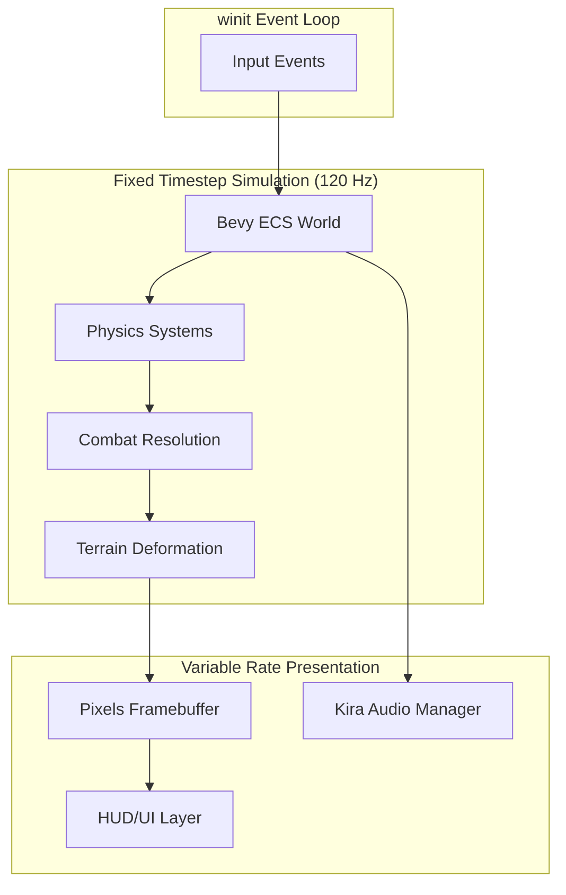
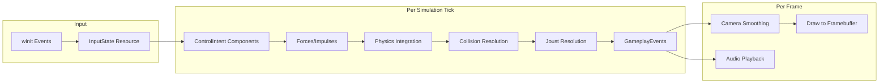
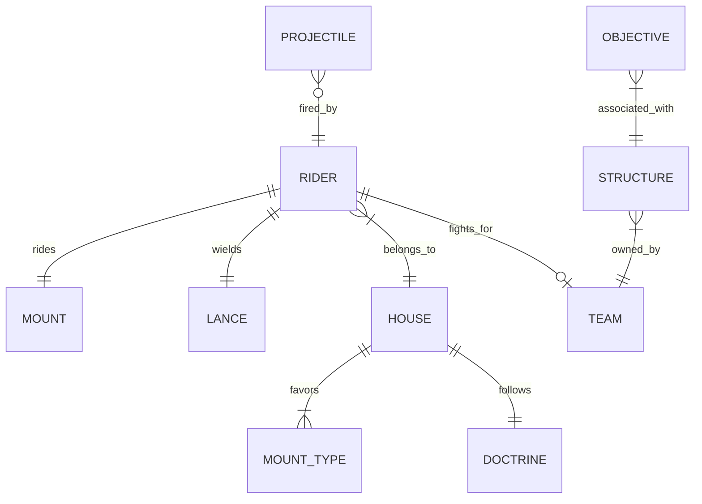
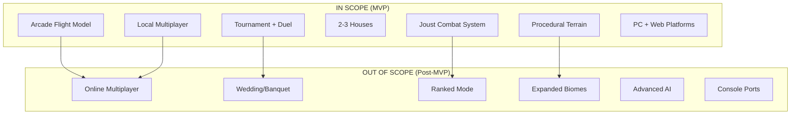
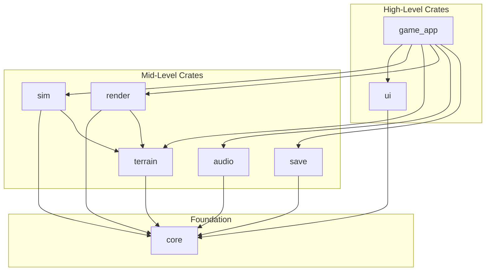

# 0. Agent Action Plan

## 0.1 Product Understanding

Based on the prompt, the Blitzy platform understands that the new product is **Project Skyjoust**, a side-scrolling arcade-action game that combines Sopwith-style territory warfare over deformable terrain with Joust-style aerial dueling mechanics. The product targets retro arcade enthusiasts and competitive-casual players seeking fast, skill-driven matches lasting 5-12 minutes.

### 0.1.1 Core Product Vision

The vision statement "Arcade jousting meets total war soap opera—played at 60 FPS" establishes the game's identity as a technically demanding, mechanically pure arcade experience with emergent narrative depth. The Blitzy platform interprets the following core pillars:

- **Height is might**: Altitude advantage directly translates to joust dominance and tactical leverage in combat encounters
- **Terrain matters**: The world is not a backdrop—it serves as cover, hazard, and a reshapable objective
- **War as a system**: Territory control and political mechanics create emergent match-to-match narratives without menu-driven complexity
- **Ceremony as mechanics**: Tournaments and negotiations function as gameplay modifiers, not cinematics

**Functional Requirements:**

- Arcade-style flight mechanics with simple pitch control, flap impulse, and dive acceleration
- Joust collision resolution system based on relative vertical position, speed, approach angle, and lance alignment timing
- Procedural terrain generation with local deformation (craters, collapsed structures)
- Territory control system with keeps, outposts, shrines, and supply routes
- Special events system (tournaments, duels) that alter gameplay constraints
- Multi-house identity system with distinctive mounts, doctrines, and kit pieces
- Local multiplayer support (split-screen/shared-screen) as a first-class requirement

**Non-Functional Requirements:**

- **Performance**: Locked 60 FPS on target hardware with deterministic physics and collision
- **Latency**: Low-latency input with buffered actions and generous coyote-time windows
- **Determinism**: Strongly preferred deterministic simulation for potential online multiplayer
- **Scalability**: Architecture designed to support future rollback-friendly networking
- **Portability**: Cross-platform support for PC (Windows/macOS/Linux) and Web browsers

**Implicit Requirements Surfaced:**

- Audio feedback system for lance impacts, wing beats, and ceremony stingers
- Camera system for tracking aerial combat with screen-shake effects
- HUD system for altitude advantage, lance brace window, ammo, and objective state
- Replay groundwork (seed + input stream) for debugging and sharing
- Asset pipeline supporting `include_bytes!` for WASM packaging

### 0.1.2 User Instructions Interpretation

**Technology Stack Preferences (Explicitly Specified):**

- **Primary Language**: Rust (2024 edition)
- **ECS Framework**: Bevy ECS for world/schedule management (not rendering)
- **Rendering**: Pixels crate for GPU-powered pixel framebuffer
- **Audio**: Kira for expressive game audio with tweens and mixer effects
- **Windowing**: winit for cross-platform event loop management

**Architecture Patterns Mentioned:**

User Example (preserved exactly): "Bevy's `App` exists, but we provide a **custom runner** so winit + Pixels remains in charge of the window and swapchain. Bevy becomes the world/schedule engine."

- Simulation runs at fixed 120 Hz timestep (`SIM_DT = 1/120s`)
- Rendering runs at variable rate (vsync) with optional interpolation
- Clean separation between authoritative simulation and presentation layers
- Integer subpixel positioning (e.g., 1 unit = 1/256 pixel) for deterministic positioning

**Integration Requirements:**

- winit event loop drives application lifecycle
- Pixels handles framebuffer rendering with wgpu backend (Vulkan, Metal, DirectX 12)
- Kira audio manager with separate MusicBus, SfxBus, and UiBus
- Event-driven audio ingestion with rate-limiting for sound pooling

**Deployment Target Specifications:**

- Primary: PC (Windows/macOS/Linux) native binaries
- Secondary: Web (modern browsers via WASM/WebGPU)
- Input: Keyboard + mouse, gamepad, and two-player local minimum

### 0.1.3 Product Type Classification

**Product Category**: Native + Web Game Application (Arcade Action)

**Target Users and Use Cases:**

- Retro arcade enthusiasts seeking Joust/Sopwith-style immediacy
- Competitive-casual players wanting skill expression in short sessions
- Couch co-op and local versus fans requiring first-class split-screen support
- Strategy-curious players who enjoy light meta-layers without grand-strategy complexity

**Scale Expectations**: Production-ready MVP with emphasis on core gameplay feel over feature breadth. The PRD explicitly states: "ship a fun core" with 2-3 houses, 4-6 mount types, Skirmish + Warfront-lite modes.

**Maintenance and Evolution Considerations:**

- Architecture supports deterministic replay for debugging
- Versioned save system (`schema_version`) for forward compatibility
- Mod-friendly seed sharing and custom rulesets planned for post-MVP
- Online multiplayer designed as future addition without architectural rewrite


## 0.2 Background Research

Web search research was conducted to validate the proposed technology stack, identify best practices, and ensure compatibility across the chosen components.

### 0.2.1 Technology Research

**Bevy ECS Framework Research:**

- <cite index="5-1,5-3,5-4">Bevy is a refreshingly simple data-driven game engine built in Rust that is free and open-source forever.</cite>
- <cite index="6-27,6-28,6-29">Bevy ECS is custom-built for the Bevy game engine, aiming to be "simple to use, ergonomic, fast, massively parallel, opinionated, and featureful" and can be used as a standalone crate in other projects.</cite>
- <cite index="4-1">Bevy has upgraded to Rust 2024 and made Transform propagation parallel, improving performance significantly.</cite>
- <cite index="6-62,6-63">Unlike other Rust ECS implementations which often require complex lifetimes, traits, builder patterns, or macros, Bevy ECS uses normal Rust data types for all of these concepts.</cite>
- <cite index="9-6">Bevy supports compiling only 2D features without 3D features using `default-features = false, features = ["2d"]` to reduce binary size.</cite>

**Pixels Crate Research:**

- <cite index="12-1,12-2,12-3,12-4">Pixels is a tiny library providing a GPU-powered pixel frame buffer for rapidly prototyping 2D games, pixel-based animations, software renderers, or emulators, with options to add custom shaders for CRT simulation or VFX.</cite>
- <cite index="12-7,12-8">Pixels is built on modern graphics APIs powered by wgpu: Vulkan, Metal, DirectX 12, OpenGL ES3, with DirectX 11, WebGL2, and WebGPU support in progress.</cite>
- <cite index="17-1,17-3,17-4">Pixels represents a 2D pixel buffer with explicit image resolution, ideal for prototyping pixel-based games and emulators, rendered entirely on the GPU with customizable shader pipeline.</cite>
- <cite index="18-28">The latest version is 0.15.0 with over 369.1K total downloads, indicating production-ready stability.</cite>

**Kira Audio Library Research:**

- <cite index="21-1,21-8,21-9">Kira is a backend-agnostic library to create expressive audio for games, providing tweens for smoothly adjusting properties of sounds, a flexible mixer for applying effects, a clock system for precisely timing audio events, and spatial audio support.</cite>
- <cite index="22-3,22-4">Kira can be used in WASM environments with certain limitations, and the maintainers welcome help improving WASM support.</cite>
- <cite index="21-7">Kira version 0.10.8 is available and licensed under MIT OR Apache-2.0.</cite>
- <cite index="28-1,28-10">The bevy_kira_audio plugin integrates Kira with Bevy's ECS for controlling running game audio via Bevy's system architecture.</cite>

**winit Window Management Research:**

- <cite index="53-21,53-22">winit is a cross-platform window creation library with 26.7M total downloads, using version 0.30.12.</cite>
- <cite index="59-8,59-9,59-10">Winit is a cross-platform window creation and event loop management library, requiring an EventLoop before Window creation via `EventLoop::new()`.</cite>
- <cite index="55-5,55-6">Winit is designed to be a low-level brick in a hierarchy of libraries, and to display content you need platform-specific getters or another library.</cite>

### 0.2.2 Architecture Pattern Research

**Fixed Timestep Physics Patterns:**

- <cite index="31-1,31-25,31-26">The recommended approach is to advance physics simulation in fixed dt time steps while keeping up with renderer timer values, so the simulation advances at the correct rate—for example, 100fps physics requires two steps every 50fps display update.</cite>
- <cite index="31-3,31-4">Fixed timestep is required for exact reproducibility and deterministic lockstep networking, which helps the simulation behave exactly the same from run to run without frame rate dependency.</cite>
- <cite index="37-1,37-2">Fixed timesteps enforce physics updates at precisely incremented intervals irrespective of frame rate, preventing visual artifacts from low frame rates and physics instability from very high rates.</cite>
- <cite index="38-1">Fixed steps enable deterministic replays and lockstep networking by removing frame variability from integration.</cite>
- <cite index="38-26">As a rule of thumb, choose a physics step between 1/120 and 1/50 seconds for real-time play, lowering the step when tall stacks or precise constraints appear.</cite>

**Deterministic Simulation Best Practices:**

- <cite index="32-16,32-17">The main cause for lack of determinism in game engines is caused by not using the same sample rate for the whole simulation, combined with floating point precision issues per IEEE754.</cite>
- <cite index="35-9,35-10,35-11">Modern engines measure time in "Ticks" using 64-bit integers (nanoseconds) because integers never lose precision—16,666,667 ticks is always exactly that value on every machine.</cite>
- <cite index="35-22,35-23,35-24">For guaranteed determinism, abandoning floating point numbers entirely in favor of integers solves both determinism (identical behavior on every processor) and precision (uniform precision across the number line).</cite>
- <cite index="39-17,39-18,39-19,39-20">Determinism allows reproducing bugs and crashes reliably, which is invaluable for debugging rare issues that may occur only once in thousands of player matches.</cite>

### 0.2.3 Dependency and Tool Research

**Procedural Terrain Generation Algorithms:**

- <cite index="41-2,41-3,41-4,41-5">Noise algorithms take X and Y values and return values between 0 and 1, with Perlin Noise being commonly used and virtually every game with procedurally generated terrain using it.</cite>
- <cite index="47-1,47-2">Common techniques include Perlin noise, fractal algorithms, and heightmaps, allowing developers to generate terrains that feel natural and unique without extensive manual design.</cite>
- <cite index="49-34,49-35,49-36,49-37">Simplex Noise was created to overcome Perlin Noise weaknesses in higher dimensions—Perlin Noise is O(n×2^n) while Simplex Noise is O(n²), making it polynomial time.</cite>
- <cite index="63-1,63-3,63-4">The Rust `noise` crate is a procedural noise generation library supporting Perlin, Simplex, and other noise functions that can be combined for complex results.</cite>
- <cite index="61-1,61-2">The noise-rs library generates smoothly varying noise for textural use, with noise generators contained in NoiseFn modules that can be combined for complex results.</cite>

**Recommended Dependency Versions:**

| Dependency | Version | Purpose |
|-----------|---------|---------|
| bevy | 0.17.x | ECS and scheduling framework |
| pixels | 0.15.0 | GPU-powered pixel framebuffer |
| kira | 0.10.8 | Expressive game audio |
| winit | 0.30.12 | Cross-platform window management |
| wgpu | 28.0 | GPU abstraction layer |
| noise | latest | Procedural noise generation |

**Testing Framework Recommendations:**

- Standard Rust test framework with `#[test]` attributes
- Property-based testing for terrain generation fairness constraints
- Golden tests for joust resolution with controlled initial conditions
- Benchmarks using `criterion` for performance-critical paths


## 0.3 Technical Architecture Design

Based on the prompt, the Blitzy platform understands that Project Skyjoust requires a hybrid architecture where Bevy functions as an ECS/scheduling framework while Pixels owns rendering and Kira owns audio. This design maintains arcade-game determinism while enabling modern GPU acceleration.

### 0.3.1 Technology Stack Selection

**Primary Language: Rust (2024 Edition)**
- **Rationale**: Memory safety without garbage collection, zero-cost abstractions, and excellent WASM compilation support. The PRD explicitly requires deterministic physics, and Rust's type system helps enforce invariants.

**Framework: Bevy ECS 0.17.x (Standalone Mode)**
- **Rationale**: Bevy provides a mature ECS with parallel system execution, but the PRD specifies using it as a "world/schedule engine" rather than a full game engine. This avoids fighting Bevy's renderer for the retro pixel aesthetic.

**Rendering: Pixels 0.15.0**
- **Rationale**: Provides hardware-accelerated pixel framebuffer with perfect pixel boundaries, ideal for the "readable silhouette-first 2D" art direction. Supports custom shaders for CRT effects or visual polish.

**Audio: Kira 0.10.8**
- **Rationale**: Backend-agnostic library with tweens, mixer effects, and clock system for precise audio timing. Essential for ceremony stingers and positional audio cues for incoming attacks.

**Windowing: winit 0.30.12**
- **Rationale**: Cross-platform window and event loop management that integrates with Pixels via raw-window-handle. Supports custom runners for the required fixed-timestep architecture.

**Additional Technologies:**

| Technology | Version | Rationale |
|------------|---------|-----------|
| noise | latest | Procedural terrain generation with Perlin/Simplex support |
| glam | latest | Fast math types compatible with Bevy |
| rand | latest | Seeded RNG for deterministic generation |
| serde | 1.x | Save/load serialization |
| pollster | 0.3 | Async blocking for initialization |

### 0.3.2 Architecture Pattern

**Overall Pattern: Custom Runner with ECS Core**

The architecture follows a modified Model-View-Controller pattern where:
- **Model (Simulation)**: Bevy ECS world with fixed-timestep systems
- **View (Presentation)**: Pixels framebuffer + Kira audio
- **Controller (Input)**: winit event loop driving both layers



**Justification**: This pattern matches the PRD's explicit requirement for "ruthless discipline" in scheduling. The fixed timestep simulation guarantees deterministic physics, while variable-rate presentation maximizes visual smoothness.

**Component Interaction Model:**

- winit pumps events and updates `InputState` resource
- Accumulator tracks simulation debt (0..N ticks per frame)
- Each tick: Bevy's fixed schedule runs simulation systems
- After simulation catches up: presentation pass renders and plays audio
- Pixels presents the final frame

**Data Flow Architecture:**



### 0.3.3 Integration Points

**External Services to Integrate:**

- None for MVP (offline-first design)
- Future: Game server for online multiplayer using rollback netcode

**API Contracts to Implement:**

| Interface | Purpose | Design |
|-----------|---------|--------|
| `NoiseFn` trait | Terrain generation | Seeded noise → height values |
| `ApplicationHandler` | winit integration | Event callbacks |
| `AudioManager` | Kira integration | Sound playback control |

**Data Exchange Formats:**

- Save files: Binary with serde + compression
- Replay files: Seed + serialized input stream
- Config files: TOML or RON for human readability

**Authentication and Authorization:**

- Not applicable for MVP (local play only)
- Future: Consider Steam/Epic integration for online features

### 0.3.4 Security Architecture

**Input Validation:**
- All player inputs clamped to valid ranges before simulation
- Seed values validated for reproducibility

**Memory Safety:**
- Rust's ownership system prevents buffer overflows
- No unsafe code in gameplay systems (unsafe limited to FFI boundaries)

**Asset Security:**
- Assets embedded via `include_bytes!` for tamper resistance in WASM
- Save files versioned and validated on load

### 0.3.5 System Scheduling Detail

**Simulation Tick Schedule (Fixed 120 Hz):**

```
1. Input Sampling → ControlIntent components
2. Control → Forces → Apply flap, dive, brake impulses
3. Physics Integrate → Gravity, drag, position updates
4. Collision Build → Spatial hash broadphase
5. Collision Resolve → Narrowphase + terrain contacts
6. Combat Resolution → Joust detection and outcomes
7. Ordinance + Deformation → Terrain modifications
8. Objectives + Morale → Capture progress, score updates
9. Special Events → Tournament/duel state machines
10. Cleanup → Despawn, timer expiry, compaction
```

**Presentation Pass (Variable Rate):**

```
1. Camera smoothing and animation advance
2. Draw layers to Pixels framebuffer
3. Audio event consumption and playback
4. HUD/menu rendering
```


## 0.4 Repository Structure Planning

Based on the prompt, the Blitzy platform understands that the repository structure should reflect the modular crate layout specified in the PRD, with clear separation between simulation, rendering, audio, and game application layers.

### 0.4.1 Proposed Repository Structure

```
skyjoust/
├── Cargo.toml                      # Workspace manifest
├── Cargo.lock                      # Dependency lockfile
├── README.md                       # Project documentation
├── LICENSE                         # MIT/Apache-2.0 dual license
├── .gitignore                      # Git ignore rules
├── .env.example                    # Environment variables template
├── rustfmt.toml                    # Code formatting configuration
├── clippy.toml                     # Linting configuration
│
├── crates/                         # Workspace crates
│   ├── game_app/                   # Main application crate
│   │   ├── Cargo.toml
│   │   └── src/
│   │       ├── main.rs             # Entry point, winit runner
│   │       ├── app.rs              # Bevy App construction, plugins
│   │       ├── runner.rs           # Custom runner for winit+Pixels
│   │       ├── input.rs            # Input state management
│   │       └── states.rs           # Application state machine
│   │
│   ├── core/                       # Core types and utilities
│   │   ├── Cargo.toml
│   │   └── src/
│   │       ├── lib.rs              # Crate root
│   │       ├── math.rs             # Fixed-point/subpixel integer types
│   │       ├── ids.rs              # Stable ordering keys for entities
│   │       ├── events.rs           # Typed gameplay events
│   │       └── config.rs           # Tuning constants, loadable settings
│   │
│   ├── sim/                        # Simulation systems
│   │   ├── Cargo.toml
│   │   └── src/
│   │       ├── lib.rs              # Crate root, plugin registration
│   │       ├── movement.rs         # Mount flight model systems
│   │       ├── physics.rs          # Integration, forces, gravity
│   │       ├── collision/          # Collision subsystem
│   │       │   ├── mod.rs          # Collision module root
│   │       │   ├── broadphase.rs   # Spatial hash grid
│   │       │   ├── narrowphase.rs  # Shape-to-shape resolution
│   │       │   └── resolution.rs   # Penetration response
│   │       ├── combat/             # Combat subsystem
│   │       │   ├── mod.rs          # Combat module root
│   │       │   ├── joust.rs        # Joust contact detection/resolution
│   │       │   ├── ordinance.rs    # Bombs, projectiles, area denial
│   │       │   └── damage.rs       # Health, knockback, stun effects
│   │       ├── objectives.rs       # Keeps, outposts, morale tracking
│   │       ├── special_events.rs   # Tournament, duel, truce state machines
│   │       └── components.rs       # All ECS components for simulation
│   │
│   ├── terrain/                    # Procedural terrain system
│   │   ├── Cargo.toml
│   │   └── src/
│   │       ├── lib.rs              # Crate root
│   │       ├── gen/                # Generation subsystem
│   │       │   ├── mod.rs          # Generation module root
│   │       │   ├── noise.rs        # Seeded noise field generation
│   │       │   ├── biomes.rs       # Biome parameter handling
│   │       │   └── structures.rs   # Keep/outpost placement
│   │       ├── chunks.rs           # Chunk storage, dirty tracking
│   │       ├── deform.rs           # Explosion craters, collapse
│   │       ├── materials.rs        # Material enum (Air, Dirt, Rock, etc.)
│   │       └── collision.rs        # Terrain sampling, contact queries
│   │
│   ├── render/                     # Rendering subsystem
│   │   ├── Cargo.toml
│   │   └── src/
│   │       ├── lib.rs              # Crate root
│   │       ├── framebuffer.rs      # Pixels target, scaling logic
│   │       ├── atlas.rs            # Sprite sheet loading and lookup
│   │       ├── font.rs             # Bitmap font rendering
│   │       ├── draw/               # Drawing subsystem
│   │       │   ├── mod.rs          # Draw module root
│   │       │   ├── layers.rs       # Layer ordering and culling
│   │       │   ├── sprites.rs      # Entity sprite blitting
│   │       │   ├── terrain.rs      # Chunk rendering, caching
│   │       │   └── parallax.rs     # Background layer scrolling
│   │       ├── effects.rs          # Screen shake, flash, palette
│   │       └── camera.rs           # Camera position and smoothing
│   │
│   ├── audio/                      # Audio subsystem
│   │   ├── Cargo.toml
│   │   └── src/
│   │       ├── lib.rs              # Crate root
│   │       ├── kira_backend.rs     # AudioManager, buses, handles
│   │       ├── sfx.rs              # Event→sound mapping, pooling
│   │       └── music.rs            # Stateful layering, crossfades
│   │
│   ├── ui/                         # User interface
│   │   ├── Cargo.toml
│   │   └── src/
│   │       ├── lib.rs              # Crate root
│   │       ├── hud/                # In-game HUD
│   │       │   ├── mod.rs          # HUD module root
│   │       │   ├── altitude.rs     # Altitude advantage indicator
│   │       │   ├── lance.rs        # Brace window visualization
│   │       │   ├── objectives.rs   # Capture progress, morale bars
│   │       │   └── ammo.rs         # Ordinance/resupply status
│   │       ├── menus/              # Menu screens
│   │       │   ├── mod.rs          # Menus module root
│   │       │   ├── main_menu.rs    # Title and mode selection
│   │       │   ├── house_select.rs # House/loadout selection
│   │       │   └── warfront.rs     # Campaign map interface
│   │       └── debug.rs            # FPS, seed display, overlays
│   │
│   └── save/                       # Persistence
│       ├── Cargo.toml
│       └── src/
│           ├── lib.rs              # Crate root
│           ├── warfront.rs         # Campaign state serialization
│           ├── settings.rs         # Player preferences
│           └── replay.rs           # Replay recording/playback groundwork
│
├── assets/                         # Game assets (embedded at build)
│   ├── sprites/                    # Sprite atlases
│   │   ├── mounts/                 # Mount animation frames
│   │   ├── riders/                 # Rider/house heraldry
│   │   ├── terrain/                # Terrain tile graphics
│   │   ├── effects/                # Particles, explosions
│   │   └── ui/                     # HUD elements, icons
│   ├── fonts/                      # Bitmap fonts
│   ├── audio/                      # Sound effects and music
│   │   ├── sfx/                    # Sound effects
│   │   └── music/                  # Background music tracks
│   └── config/                     # Configuration files
│       ├── houses.toml             # House definitions
│       ├── mounts.toml             # Mount statistics
│       └── tuning.toml             # Gameplay tuning constants
│
├── tests/                          # Integration tests
│   ├── terrain_gen_test.rs         # Terrain generation determinism
│   ├── joust_resolution_test.rs    # Combat outcome golden tests
│   ├── fairness_test.rs            # Map fairness property tests
│   └── fixtures/                   # Test data and seeds
│
├── benches/                        # Performance benchmarks
│   ├── terrain_deform_bench.rs     # Deformation performance
│   ├── collision_bench.rs          # Broadphase/narrowphase timing
│   └── render_bench.rs             # Framebuffer drawing speed
│
├── docs/                           # Documentation
│   ├── architecture.md             # Architecture overview
│   ├── joust_mechanics.md          # Combat system documentation
│   ├── terrain_generation.md       # Procedural generation details
│   └── diagrams/                   # Architecture diagrams
│
└── scripts/                        # Utility scripts
    ├── build_wasm.sh               # WASM build script
    ├── run_tests.sh                # Test runner script
    └── format_check.sh             # CI formatting check
```

### 0.4.2 File Path Specifications

**Core Application Files:**

| File Path | Purpose |
|-----------|---------|
| `crates/game_app/src/main.rs` | Application entry point, winit event loop initialization |
| `crates/game_app/src/runner.rs` | Custom Bevy runner integrating with Pixels presentation |
| `crates/game_app/src/app.rs` | Bevy App construction, plugin registration, schedule setup |

**Simulation Files:**

| File Path | Purpose |
|-----------|---------|
| `crates/sim/src/components.rs` | Define Transform2D, Velocity2D, Mount, Rider, Lance, Health |
| `crates/sim/src/movement.rs` | Flight model: flap impulse, dive, drag, altitude mechanics |
| `crates/sim/src/combat/joust.rs` | Joust cone detection, engagement scoring, outcome resolution |
| `crates/sim/src/collision/broadphase.rs` | Spatial hash grid population and pair generation |

**Terrain Files:**

| File Path | Purpose |
|-----------|---------|
| `crates/terrain/src/gen/noise.rs` | Seeded Perlin/Simplex noise for terrain height |
| `crates/terrain/src/chunks.rs` | Chunk storage with `HashMap<ChunkCoord, Chunk>` |
| `crates/terrain/src/deform.rs` | Explosion radius carving, rubble deposit |

**Configuration Files:**

| File Path | Purpose |
|-----------|---------|
| `assets/config/tuning.toml` | Gameplay tuning constants (gravity, flap power, etc.) |
| `assets/config/houses.toml` | House definitions with heraldry, doctrines |
| `Cargo.toml` | Workspace manifest with feature flags |
| `.env.example` | Environment variables for development |

**Entry Points:**

| File Path | Purpose |
|-----------|---------|
| `crates/game_app/src/main.rs` | Native application entry |
| `crates/game_app/src/lib.rs` | WASM entry point (with `wasm_bindgen`) |


## 0.5 Implementation Specifications

Based on the prompt, the Blitzy platform understands that the implementation must deliver the core arcade feel with deterministic physics while supporting the PRD's ECS-driven architecture.

### 0.5.1 Core Components to Implement

**Component A: Flight Model System**
- **Purpose**: Implement arcade-style mount movement with altitude advantage mechanics
- **Location**: `crates/sim/src/movement.rs`
- **Key Interfaces**:
  - `apply_flap_impulse(mount: &Mount, velocity: &mut Velocity2D)`
  - `apply_gravity_and_drag(dt: FixedTime, velocity: &mut Velocity2D)`
  - `update_altitude_advantage(riders: Query<&Transform2D, &mut AltitudeAdvantage>)`

**Component B: Joust Resolution System**
- **Purpose**: Detect lance cone intersections and resolve combat outcomes deterministically
- **Location**: `crates/sim/src/combat/joust.rs`
- **Key Interfaces**:
  - `detect_joust_opportunities(Query<&Transform2D, &Lance, &Team>) -> Vec<Engagement>`
  - `resolve_engagement(engagement: &Engagement) -> JoustOutcome`
  - `apply_joust_outcome(outcome: &JoustOutcome, commands: &mut Commands)`
- **Dependencies**: Collision system, Components (Lance, Rider, Health)

**Component C: Terrain Generation System**
- **Purpose**: Generate procedural terrain from seeds with fairness constraints
- **Location**: `crates/terrain/src/gen/`
- **Key Interfaces**:
  - `generate_world(seed: u64, params: &BiomeParams) -> TerrainWorld`
  - `validate_fairness(world: &TerrainWorld) -> FairnessReport`
  - `place_structures(world: &mut TerrainWorld, rules: &PlacementRules)`

**Component D: Collision System**
- **Purpose**: Efficient spatial queries and physics response for entities and terrain
- **Location**: `crates/sim/src/collision/`
- **Key Interfaces**:
  - `build_spatial_hash(entities: Query<&Transform2D, &Collider>) -> SpatialHash`
  - `query_pairs(hash: &SpatialHash) -> Vec<(Entity, Entity)>`
  - `resolve_terrain_contact(pos: IVec2, terrain: &TerrainWorld) -> Option<Contact>`

**Component E: Audio Event System**
- **Purpose**: Map gameplay events to sound playback with rate limiting
- **Location**: `crates/audio/src/sfx.rs`
- **Key Interfaces**:
  - `process_audio_events(events: EventReader<AudioEvent>, manager: &mut AudioManager)`
  - `apply_spatial_panning(event: &AudioEvent, camera: &Camera) -> Panning`
- **Dependencies**: Kira AudioManager, GameplayEvent system

### 0.5.2 Data Models and Schemas

**Core ECS Components:**

```rust
// Transform in subpixel integer space
pub struct Transform2D {
    pub pos: IVec2,    // 1 unit = 1/256 pixel
    pub rot: i16,      // Fixed-angle rotation
}

// Velocity for deterministic integration
pub struct Velocity2D {
    pub v: IVec2,      // Subpixel velocity
}

// Mount handling characteristics
pub struct Mount {
    pub kind: MountKind,
    pub flap_power: i32,
    pub stall_speed: i32,
    pub drag_coefficient: i32,
    pub turn_radius: i32,
}

// Rider state and house affiliation
pub struct Rider {
    pub house_id: HouseId,
    pub stamina: i32,
    pub unhorsed_timer: Option<u32>,
}

// Lance combat state
pub struct Lance {
    pub state: LanceState,
    pub brace_window: u32,
    pub reach: i32,
    pub cone_angle: i16,
}
```

**Entity Relationship Model:**



**Terrain Data Structures:**

```rust
// Chunk coordinate key
pub struct ChunkCoord { pub x: i32, pub y: i32 }

// Single terrain chunk
pub struct Chunk {
    pub cells: Vec<Material>,  // CHUNK_SIZE × CHUNK_SIZE
    pub dirty_rect: Option<Rect>,
    pub collision_cache: Option<CollisionSpans>,
}

// Material types for terrain cells
pub enum Material {
    Air,
    Dirt,
    Rock,
    Wood,
    Stonework,
    Water,
    Rubble,
}
```

**Validation Rules and Constraints:**

| Entity | Constraint | Validation |
|--------|------------|------------|
| Mount | `flap_power > 0` | Prevents zero-thrust mounts |
| Lance | `cone_angle ∈ [0, 180]` | Valid cone geometry |
| Chunk | `cells.len() == CHUNK_SIZE²` | Consistent chunk sizing |
| Seed | `seed != 0` | Prevents degenerate RNG |

### 0.5.3 API Specifications

**Game State Resources:**

| Resource | Purpose | Access Pattern |
|----------|---------|----------------|
| `GameClock` | Fixed timestep accumulator | Read/Write per frame |
| `InputState` | Player input buffer | Write from winit, Read from systems |
| `RngState` | Deterministic random generator | Read/Write from generation/combat |
| `TerrainWorld` | Chunk storage and queries | Read from render, Write from deform |
| `MatchRules` | Active ruleset modifiers | Read from all, Write from events |
| `MatchState` | Morale, score, timers | Read/Write from objectives |

**Gameplay Event Types:**

```rust
pub enum GameplayEvent {
    // Combat events
    JoustHit { winner: Entity, loser: Entity, outcome: JoustOutcome },
    Unhorsed { rider: Entity, duration: u32 },
    LanceShattered { rider: Entity },
    
    // Ordinance events
    BombDropped { pos: IVec2, fuse: u32 },
    Explosion { pos: IVec2, radius: i32 },
    TerrainDeformed { chunk: ChunkCoord },
    
    // Objective events
    OutpostCaptured { outpost: Entity, team: Team },
    MoraleChanged { team: Team, delta: i32 },
    KeepDamaged { keep: Entity, damage: i32 },
    
    // Special events
    TournamentStarted,
    DuelChallenged { challenger: Entity, challenged: Entity },
    TruceBegins { houses: (HouseId, HouseId) },
}
```

**Audio Event Types:**

```rust
pub enum AudioEvent {
    LanceClash { intensity: f32, position: IVec2 },
    WingFlap { mount_kind: MountKind, position: IVec2 },
    Explosion { size: ExplosionSize, position: IVec2 },
    CaptureComplete { objective_kind: ObjectiveKind },
    TournamentHorn,
    DuelDrums,
    VictoryFanfare { house: HouseId },
}
```

### 0.5.4 Joust Resolution Algorithm

The joust system is the signature mechanic and must feel deterministic and fair:

**Engagement Detection:**

```rust
// Pseudocode for joust detection
fn detect_engagements(riders: Query<...>) -> Vec<Engagement> {
    for (a, b) in candidate_pairs {
        if in_lance_cone(a, b) && within_reach(a, b) {
            engagements.push(Engagement { a, b, tick });
        }
    }
    // Sort by (tick, min_id, max_id) for determinism
    engagements.sort_by_key(|e| (e.tick, e.a.min(e.b), e.a.max(e.b)));
    engagements
}
```

**Advantage Scoring:**

| Factor | Weight | Calculation |
|--------|--------|-------------|
| Height Delta | 40% | `(a.pos.y - b.pos.y) / SCALE` |
| Vertical Velocity | 20% | `(a.vel.y - b.vel.y) / SCALE` |
| Brace Timing | 25% | `1.0 if braced_in_window else 0.5` |
| Mount Modifier | 10% | `mount.joust_bonus` |
| Debuffs | 5% | `1.0 - debuff_penalty` |

**Outcome Resolution:**

| Advantage Score | Outcome |
|-----------------|---------|
| `> 0.8` | Clean Kill |
| `0.5 - 0.8` | Unhorse + Knockback |
| `0.2 - 0.5` | Knockback Only |
| `< 0.2` | Lance Shatter (disadvantaged) |

### 0.5.5 User Interface Design

**HUD Elements (In-Match):**

| Element | Position | Information |
|---------|----------|-------------|
| Altitude Indicator | Left edge | Vertical bar showing relative altitude advantage |
| Lance Brace Window | Center-bottom | Timing indicator for brace mechanic |
| Ammo/Ordinance | Bottom-right | Current ordinance count, resupply hints |
| Objective Status | Top | Outpost capture progress, morale bars |
| Event Banner | Top-center | Rules change summary (one line + icon) |

**Warfront Map UI:**

| Element | Purpose |
|---------|---------|
| Region Grid | Territory control visualization with house colors |
| Supply Lines | Predicted resource flow paths |
| Event Forecast | Fog-of-war style probability indicators |
| Action Panel | Battle initiation, diplomacy options |

The UI follows the PRD's requirement for "readable silhouette-first 2D" with bitmap fonts and high-contrast iconography suitable for the retro pixel aesthetic.


## 0.6 Scope Definition

Based on the prompt, the Blitzy platform understands that the MVP scope must focus on proving the core arcade feel before expanding features. The PRD explicitly states: "ship a fun core" with bounded feature sets.

### 0.6.1 Explicitly In Scope

**Core Gameplay Systems:**

- Arcade flight model with simple pitch control, flap impulse, and dive acceleration
- Joust collision system with altitude advantage, brace timing, and four outcome types (unhorse, knockback, shatter, clean kill)
- Two ordinance types (bombs/firepots for terrain damage, light ranged for chip damage)
- Procedural terrain generation with local deformation (craters, collapsed structures)
- Territory control with keeps, outposts, and morale system

**Content Scope:**

- 2-3 noble houses with distinctive heraldry, signature mounts, and passive doctrines
- 4-6 mount types including variants per house
- 2 special events: Tournament (joust-focused ruleset) and Duel (champion challenge)
- Single procedural biome (hills, cliffs, river gorges) with fairness constraints

**Game Modes:**

- **Skirmish**: Quick play single match with selectable rulesets
- **Warfront-lite**: String of matches across a shifting territorial map
- **Local Versus**: Split-screen or shared-screen two-player support

**Technical Infrastructure:**

- Custom winit runner with Bevy ECS as world/schedule engine
- Pixels-based framebuffer rendering at fixed internal resolution
- Kira audio integration with three buses (Music, SFX, UI)
- Fixed 120 Hz simulation timestep with variable-rate presentation
- Seeded terrain generation with reproducible results
- Save/load system for Warfront campaign state

**Input Support:**

- Keyboard + mouse controls
- Gamepad support
- Two-player local input handling

**Platform Targets:**

- PC native: Windows, macOS, Linux
- Web: Modern browsers via WASM/WebGPU

**Essential Documentation:**

- README with build instructions
- Architecture overview document
- Gameplay mechanics documentation (joust system)

### 0.6.2 Explicitly Out of Scope

**Deferred Features (Post-MVP):**

- **Online Multiplayer**: Rollback netcode, matchmaking, lobbies
- **Wedding/Banquet Events**: Full diplomacy and alliance mechanics
- **Ranked Jousting Circuit**: Tournament-focused competitive ladder
- **Expanded Biomes**: Additional terrain types beyond initial procedural system
- **Mod Support**: Custom ruleset sharing, user-generated content tools

**Advanced Systems:**

- Deep grand strategy layer (complex political simulation)
- Simulation-grade flight physics (realistic aerodynamics)
- Large roster expansion before core feel is validated
- AI for single-player vs. CPU opponents (basic tutorial AI only)

**Production Deployment:**

- Cloud infrastructure for online services
- Automated CI/CD pipelines (manual builds acceptable for MVP)
- Comprehensive monitoring and logging frameworks
- Analytics dashboards and telemetry pipelines

**Platform Expansions:**

- Console ports (PlayStation, Xbox, Nintendo Switch)
- Mobile ports (iOS, Android)
- VR/AR adaptations

**Localization:**

- Internationalization framework
- Translated text content
- Region-specific asset variants

**Accessibility Beyond Basics:**

While basic accessibility is in scope (remappable controls, visual clarity options), the following are deferred:
- Full screen reader support
- Colorblind-specific modes beyond high-contrast
- Comprehensive subtitling system
- One-handed control schemes

### 0.6.3 Scope Boundaries Summary



### 0.6.4 Risk Mitigation Boundaries

The PRD identifies specific risks with mitigations that define scope boundaries:

| Risk | Mitigation | Scope Impact |
|------|------------|--------------|
| Joust feels random | Strict resolution rules + strong feedback | Must implement brace timing, visual cones, slow-motion on decisive contacts |
| Procedural maps decide outcomes | Fairness constraints, mirrored placement | Must validate with property tests before shipping |
| Ceremony events feel like interruptions | Short, mechanically meaningful events | Events queued between battles, not forced mid-match |
| Too many systems dilute arcade purity | Ship MVP with territory + ceremony layers only | No diplomacy until action loop is proven |

### 0.6.5 Success Criteria for MVP

The PRD defines specific success metrics that bound the MVP scope:

- **Match Length**: Median 6-10 minutes (validates pacing)
- **New Player Retention**: Tutorial completion rate, first-win rate
- **Balance Health**: No house/loadout exceeds target win-rate bands
- **Procedural Fairness**: Low rate of "unwinnable terrain" reports

These metrics require instrumentation but not full analytics infrastructure for MVP validation.


## 0.7 Deliverable Mapping

Based on the prompt, the Blitzy platform understands that all deliverables must map directly to the PRD requirements and follow the crate structure established in the repository planning.

### 0.7.1 File Creation Plan

**Core Application Crate (`game_app`)**

| File Path | Purpose | Content Type | Priority |
|-----------|---------|--------------|----------|
| `crates/game_app/Cargo.toml` | Crate manifest with dependencies | Config | High |
| `crates/game_app/src/main.rs` | Application entry point, winit initialization | Source | High |
| `crates/game_app/src/runner.rs` | Custom Bevy runner for Pixels integration | Source | High |
| `crates/game_app/src/app.rs` | Bevy App construction, plugin registration | Source | High |
| `crates/game_app/src/input.rs` | InputState resource, event mapping | Source | High |
| `crates/game_app/src/states.rs` | Application state machine (Menu, Playing, Paused) | Source | Medium |

**Core Types Crate (`core`)**

| File Path | Purpose | Content Type | Priority |
|-----------|---------|--------------|----------|
| `crates/core/Cargo.toml` | Crate manifest | Config | High |
| `crates/core/src/lib.rs` | Crate root, module exports | Source | High |
| `crates/core/src/math.rs` | IVec2, FixedPoint types, subpixel utilities | Source | High |
| `crates/core/src/ids.rs` | Entity ordering keys for determinism | Source | Medium |
| `crates/core/src/events.rs` | GameplayEvent, AudioEvent enums | Source | High |
| `crates/core/src/config.rs` | Tuning constant structs, TOML loading | Source | Medium |

**Simulation Crate (`sim`)**

| File Path | Purpose | Content Type | Priority |
|-----------|---------|--------------|----------|
| `crates/sim/Cargo.toml` | Crate manifest | Config | High |
| `crates/sim/src/lib.rs` | SimPlugin registration, schedule setup | Source | High |
| `crates/sim/src/components.rs` | Transform2D, Velocity2D, Mount, Rider, Lance, Health | Source | High |
| `crates/sim/src/movement.rs` | Flight model systems (flap, dive, drag) | Source | High |
| `crates/sim/src/physics.rs` | Gravity, integration, velocity clamping | Source | High |
| `crates/sim/src/collision/mod.rs` | Collision module root | Source | High |
| `crates/sim/src/collision/broadphase.rs` | Spatial hash grid construction | Source | High |
| `crates/sim/src/collision/narrowphase.rs` | Shape intersection tests | Source | High |
| `crates/sim/src/collision/resolution.rs` | Penetration response, terrain slide | Source | High |
| `crates/sim/src/combat/mod.rs` | Combat module root | Source | High |
| `crates/sim/src/combat/joust.rs` | Joust detection, scoring, outcome resolution | Source | High |
| `crates/sim/src/combat/ordinance.rs` | Bomb/projectile systems | Source | Medium |
| `crates/sim/src/combat/damage.rs` | Health, knockback, stun application | Source | High |
| `crates/sim/src/objectives.rs` | Keep/outpost capture, morale tracking | Source | Medium |
| `crates/sim/src/special_events.rs` | Tournament/duel state machines | Source | Medium |

**Terrain Crate (`terrain`)**

| File Path | Purpose | Content Type | Priority |
|-----------|---------|--------------|----------|
| `crates/terrain/Cargo.toml` | Crate manifest | Config | High |
| `crates/terrain/src/lib.rs` | TerrainPlugin, TerrainWorld resource | Source | High |
| `crates/terrain/src/gen/mod.rs` | Generation module root | Source | High |
| `crates/terrain/src/gen/noise.rs` | Seeded Perlin/Simplex noise generation | Source | High |
| `crates/terrain/src/gen/biomes.rs` | Biome parameter handling | Source | Medium |
| `crates/terrain/src/gen/structures.rs` | Keep/outpost/shrine placement | Source | Medium |
| `crates/terrain/src/chunks.rs` | Chunk struct, storage HashMap, dirty tracking | Source | High |
| `crates/terrain/src/deform.rs` | Explosion carving, rubble deposit | Source | High |
| `crates/terrain/src/materials.rs` | Material enum definitions | Source | High |
| `crates/terrain/src/collision.rs` | Terrain sampling, contact point queries | Source | High |

**Render Crate (`render`)**

| File Path | Purpose | Content Type | Priority |
|-----------|---------|--------------|----------|
| `crates/render/Cargo.toml` | Crate manifest | Config | High |
| `crates/render/src/lib.rs` | RenderPlugin, render pass function | Source | High |
| `crates/render/src/framebuffer.rs` | Pixels initialization, scaling logic | Source | High |
| `crates/render/src/atlas.rs` | Sprite sheet loading, rect lookup | Source | High |
| `crates/render/src/font.rs` | Bitmap font rendering | Source | Medium |
| `crates/render/src/draw/mod.rs` | Draw module root | Source | High |
| `crates/render/src/draw/layers.rs` | Layer ordering, visibility culling | Source | High |
| `crates/render/src/draw/sprites.rs` | Entity sprite blitting with flip/tint | Source | High |
| `crates/render/src/draw/terrain.rs` | Chunk rendering with dirty-rect caching | Source | High |
| `crates/render/src/draw/parallax.rs` | Background parallax scrolling | Source | Low |
| `crates/render/src/effects.rs` | Screen shake, flash, palette effects | Source | Medium |
| `crates/render/src/camera.rs` | Camera position, smoothing, bounds | Source | High |

**Audio Crate (`audio`)**

| File Path | Purpose | Content Type | Priority |
|-----------|---------|--------------|----------|
| `crates/audio/Cargo.toml` | Crate manifest | Config | High |
| `crates/audio/src/lib.rs` | AudioPlugin, AudioState resource | Source | High |
| `crates/audio/src/kira_backend.rs` | AudioManager setup, bus configuration | Source | High |
| `crates/audio/src/sfx.rs` | Event→sound mapping, pooling, rate limits | Source | High |
| `crates/audio/src/music.rs` | State-based layering, crossfades | Source | Medium |

**UI Crate (`ui`)**

| File Path | Purpose | Content Type | Priority |
|-----------|---------|--------------|----------|
| `crates/ui/Cargo.toml` | Crate manifest | Config | Medium |
| `crates/ui/src/lib.rs` | UIPlugin registration | Source | Medium |
| `crates/ui/src/hud/mod.rs` | HUD module root | Source | Medium |
| `crates/ui/src/hud/altitude.rs` | Altitude advantage indicator | Source | Medium |
| `crates/ui/src/hud/lance.rs` | Brace window visualization | Source | Medium |
| `crates/ui/src/hud/objectives.rs` | Capture progress, morale bars | Source | Medium |
| `crates/ui/src/hud/ammo.rs` | Ordinance status display | Source | Low |
| `crates/ui/src/menus/mod.rs` | Menu module root | Source | Medium |
| `crates/ui/src/menus/main_menu.rs` | Title screen, mode selection | Source | Medium |
| `crates/ui/src/menus/house_select.rs` | House/loadout selection | Source | Medium |
| `crates/ui/src/menus/warfront.rs` | Campaign map interface | Source | Low |
| `crates/ui/src/debug.rs` | FPS counter, seed display, overlays | Source | Low |

**Save Crate (`save`)**

| File Path | Purpose | Content Type | Priority |
|-----------|---------|--------------|----------|
| `crates/save/Cargo.toml` | Crate manifest | Config | Low |
| `crates/save/src/lib.rs` | SavePlugin, versioned save format | Source | Low |
| `crates/save/src/warfront.rs` | Campaign state serialization | Source | Low |
| `crates/save/src/settings.rs` | Player preferences persistence | Source | Low |
| `crates/save/src/replay.rs` | Replay recording groundwork | Source | Low |

**Tests and Benchmarks**

| File Path | Purpose | Content Type | Priority |
|-----------|---------|--------------|----------|
| `tests/terrain_gen_test.rs` | Terrain generation determinism tests | Test | High |
| `tests/joust_resolution_test.rs` | Combat outcome golden tests | Test | High |
| `tests/fairness_test.rs` | Map fairness property tests | Test | High |
| `benches/terrain_deform_bench.rs` | Deformation performance benchmarks | Benchmark | Medium |
| `benches/collision_bench.rs` | Collision system benchmarks | Benchmark | Medium |

**Configuration and Assets**

| File Path | Purpose | Content Type | Priority |
|-----------|---------|--------------|----------|
| `Cargo.toml` | Workspace manifest | Config | High |
| `assets/config/tuning.toml` | Gameplay tuning constants | Config | High |
| `assets/config/houses.toml` | House definitions | Config | Medium |
| `assets/config/mounts.toml` | Mount statistics | Config | Medium |
| `README.md` | Project documentation | Documentation | High |
| `docs/architecture.md` | Architecture overview | Documentation | Medium |
| `docs/joust_mechanics.md` | Combat system documentation | Documentation | Medium |

### 0.7.2 Implementation Phases

**Phase 1: Foundation**
- Workspace setup with all crate Cargo.toml files
- Core types (math, events, config)
- winit + Pixels + Bevy integration (`game_app`)
- Basic render loop with placeholder content

**Phase 2: Core Simulation**
- ECS components for riders, mounts, lances
- Flight model systems (movement, physics)
- Collision system (broadphase, narrowphase)
- Basic terrain chunk storage

**Phase 3: Combat Systems**
- Joust detection and resolution
- Ordinance systems (bombs, projectiles)
- Damage and knockback application
- Terrain deformation

**Phase 4: Terrain Generation**
- Seeded noise generation
- Chunk generation from noise
- Structure placement (keeps, outposts)
- Fairness validation

**Phase 5: Audio Integration**
- Kira backend setup
- SFX event mapping
- Music state machine
- Positional audio

**Phase 6: UI and Polish**
- HUD elements (altitude, lance, objectives)
- Menu screens
- Special events (tournament, duel)
- Visual effects (shake, flash)

**Phase 7: Testing and Documentation**
- Unit and integration tests
- Performance benchmarks
- Architecture documentation
- README and guides


## 0.8 References

Based on the prompt, the Blitzy platform documents all source materials and research conducted during the planning phase.

### 0.8.1 User-Provided Attachments

**No attachments were provided for this project.**

The entire specification is derived from the PRD document embedded in the user prompt, titled "PRD — *Project Skyjoust* (working title)" with accompanying "High-level technical design (Rust + Bevy ECS/app + Pixels + Kira)" section.

### 0.8.2 Figma Screens

**No Figma URLs were provided for this project.**

The PRD describes UI requirements in Section 12 (UX/UI requirements) with text specifications for HUD elements and Warfront map interface, but no visual mockups were supplied.

### 0.8.3 External Documentation References

**Bevy Engine:**
- Official Repository: https://github.com/bevyengine/bevy
- Rust API Documentation: https://docs.rs/bevy
- ECS Documentation: https://docs.rs/bevy_ecs

**Pixels Crate:**
- Official Repository: https://github.com/parasyte/pixels
- Crate Documentation: https://docs.rs/pixels
- crates.io Package: https://crates.io/crates/pixels

**Kira Audio Library:**
- Official Repository: https://github.com/tesselode/kira
- Crate Documentation: https://docs.rs/kira
- crates.io Package: https://crates.io/crates/kira

**winit Window Management:**
- Official Repository: https://github.com/rust-windowing/winit
- Crate Documentation: https://docs.rs/winit
- crates.io Package: https://crates.io/crates/winit

**Noise Generation:**
- noise-rs Repository: https://github.com/Razaekel/noise-rs
- Crate Documentation: https://docs.rs/noise

### 0.8.4 Research Sources

**Fixed Timestep and Determinism:**
- "Fix Your Timestep!" by Glenn Fiedler: https://gafferongames.com/post/fix_your_timestep/
- "Game Engines and Determinism" by Duality.ai: https://www.duality.ai/blog/game-engines-determinism

**Procedural Terrain Generation:**
- IEEE Paper: "Algorithms and Approaches for Procedural Terrain Generation - A Brief Review of Current Techniques" (2016)
- Academic Resource: "Fundamentals of Terrain Generation" - CMU Computer Science

**Game Audio Design:**
- "Audio Libraries Considered Challenging" by Tesselode: https://tesselode.github.io/articles/audio-libraries-considered-challenging/

### 0.8.5 PRD Section Summary

The user-provided PRD contains 19 sections that inform this technical specification:

| Section | Content Summary |
|---------|-----------------|
| 1. Summary | Game concept combining Sopwith and Joust mechanics |
| 2. Vision and pillars | Four gameplay pillars defining core identity |
| 3. Target audience | Player demographics and preferences |
| 4. Platforms and constraints | PC/Web targets, 60 FPS requirement, determinism |
| 5. Core game loop | Micro and macro loop definitions |
| 6. Game modes | Skirmish, Warfront, Local Versus |
| 7. Player fantasy and roles | Knight-pilot identity, loadout roles |
| 8. Core mechanics | Movement, combat, territory, terrain |
| 9. Noble houses | House identity system with doctrines |
| 10. Special events | Tournament, duel, wedding, banquet mechanics |
| 11. Progression and economy | Glory, Coin, Influence currencies |
| 12. UX/UI requirements | HUD and Warfront map specifications |
| 13. Art direction and audio | Visual and audio style guidelines |
| 14. Accessibility and difficulty | Accessibility feature requirements |
| 15. Technical requirements | Determinism, procedural generation, replay |
| 16. Analytics and success metrics | MVP validation metrics |
| 17. Scope definition | MVP vs post-MVP feature boundaries |
| 18. Risks and mitigations | Identified risks with mitigation strategies |
| 19. Milestones | Development phase definitions |

Additionally, the "High-level technical design" addendum provides:

| Section | Content Summary |
|---------|-----------------|
| Goals and non-goals | Architectural objectives and exclusions |
| Runtime architecture | winit/Bevy/Pixels integration pattern |
| Crate/module layout | Workspace structure recommendations |
| Data model | ECS components and resources |
| Scheduling | System sets and update phases |
| Terrain subsystem | Chunked tile grid design |
| Collision and joust | Resolution algorithm outline |
| Rendering with Pixels | Framebuffer-first render pipeline |
| Audio with Kira | Event-driven audio architecture |
| Asset strategy | `include_bytes!` for WASM |
| Save/load and replays | Persistence and determinism groundwork |
| Testing and tooling | Test strategy recommendations |
| Minimal runner shape | Pseudocode for integration |
| Future-proofing | Online multiplayer considerations |


## 0.9 Execution Patterns

Based on the prompt, the Blitzy platform understands that implementation must follow Rust idioms and game development best practices while maintaining the arcade-game discipline emphasized in the PRD.

### 0.9.1 Implementation Guidelines

**Rust Language Patterns:**

- Use `#[derive(Component)]` for all ECS components
- Prefer `impl` blocks over standalone functions for type-associated behavior
- Use `Result<T, E>` for fallible operations, `Option<T>` for optional values
- Leverage pattern matching exhaustively for enums
- Use `const` for compile-time constants, `static` sparingly

**Bevy ECS Conventions:**

- Register all systems via plugins (`impl Plugin for XPlugin`)
- Use `Query<>` for entity iteration, `Res<>` and `ResMut<>` for resources
- Emit events via `EventWriter<E>`, consume via `EventReader<E>`
- Organize systems into labeled sets for schedule clarity

**Naming Conventions:**

| Element | Convention | Example |
|---------|------------|---------|
| Structs | PascalCase | `Transform2D`, `JoustOutcome` |
| Functions | snake_case | `apply_flap_impulse`, `resolve_joust` |
| Constants | SCREAMING_SNAKE_CASE | `SIM_DT`, `CHUNK_SIZE` |
| Modules | snake_case | `collision`, `special_events` |
| Components | PascalCase, noun | `Rider`, `Mount`, `Lance` |
| Systems | snake_case, verb | `update_movement`, `detect_joust` |

**Error Handling Strategy:**

```rust
// Recoverable errors: return Result
fn load_config(path: &Path) -> Result<Config, ConfigError>;

// Unrecoverable/logic errors: panic with message
assert!(rider.stamina >= 0, "Stamina cannot be negative");

// Optional values: use Option
fn get_terrain_at(pos: IVec2) -> Option<Material>;
```

**Logging Guidelines:**

- Use `log` crate macros (`info!`, `debug!`, `warn!`, `error!`)
- Log significant state changes at `info!` level
- Log per-frame diagnostics at `debug!` level
- Log errors that don't panic at `error!` level

### 0.9.2 Quality Standards

**Code Style:**

- Format all code with `rustfmt` (default settings)
- Apply `clippy` lints at `warn` level minimum
- Document all public APIs with `///` doc comments
- Include examples in doc comments for complex APIs

**Documentation Requirements:**

| Level | Requirement |
|-------|-------------|
| Crate | `//!` module-level docs explaining purpose |
| Public struct | `///` docs with field explanations |
| Public function | `///` docs with parameters, returns, panics |
| Complex algorithm | Inline `//` comments explaining logic |

**Test Coverage Targets:**

| System | Target Coverage | Test Type |
|--------|-----------------|-----------|
| Joust resolution | 90%+ | Unit + Golden tests |
| Terrain generation | 85%+ | Property + Determinism tests |
| Collision detection | 80%+ | Unit tests |
| Physics integration | 75%+ | Unit tests |
| UI rendering | 50%+ | Manual + Snapshot tests |

**Performance Budgets:**

| Operation | Budget | Measurement |
|-----------|--------|-------------|
| Simulation tick | < 4ms | 120 Hz = 8.33ms available |
| Render frame | < 8ms | 60 FPS = 16.67ms available |
| Terrain deformation | < 1ms | Per explosion |
| Audio event processing | < 0.5ms | Per frame |

### 0.9.3 Security Best Practices

**Input Validation:**

```rust
// Validate all external inputs
fn process_input(raw: RawInput) -> ValidatedInput {
    ValidatedInput {
        movement: raw.movement.clamp(-1.0, 1.0),
        action: raw.action.saturating_sub(0),
    }
}
```

**Memory Safety:**

- No `unsafe` in gameplay code (defer to library boundaries)
- Use `Arc<T>` for shared ownership when necessary
- Prefer stack allocation; heap allocate only for dynamic sizes
- Clear sensitive data (seeds, save states) when no longer needed

**Determinism Enforcement:**

- Use seeded RNG (`rand::SeedableRng`) for all random operations
- Avoid `HashMap` iteration order dependencies (use `IndexMap` if order matters)
- Integer arithmetic for physics (no floating-point in simulation tick)
- Sort engagement lists before processing

### 0.9.4 Development Workflow

**Build Commands:**

```bash
# Development build

cargo build

#### Release build with optimizations

cargo build --release

#### Run with logging

RUST_LOG=debug cargo run

#### Run tests

cargo test --workspace

#### Run benchmarks

cargo bench

#### Format check

cargo fmt -- --check

#### Lint check

cargo clippy -- -D warnings

#### WASM build

cargo build --target wasm32-unknown-unknown --release
```

**Debug Tools:**

| Tool | Purpose | Usage |
|------|---------|-------|
| `ui/debug.rs` | FPS, seed display | Toggle in-game |
| Collision overlay | Visualize hitboxes | Debug build flag |
| Terrain heatmap | Solidity visualization | Debug build flag |
| Event log | Gameplay event stream | Console output |

### 0.9.5 Code Organization Principles

**Module Dependency Rules:**



**Dependency Direction:**
- Higher layers depend on lower layers, never reverse
- `core` crate has no internal dependencies
- `sim` may depend on `terrain` for collision queries
- `render` may depend on `terrain` for chunk drawing
- `game_app` orchestrates all crates

**Circular Dependency Prevention:**
- Extract shared types to `core`
- Use events for cross-system communication
- Avoid direct system-to-system calls

### 0.9.6 Version Control Practices

**Commit Message Format:**

```
<type>(<scope>): <subject>

<body>

<footer>
```

| Type | Usage |
|------|-------|
| `feat` | New feature |
| `fix` | Bug fix |
| `refactor` | Code restructuring |
| `docs` | Documentation |
| `test` | Test additions |
| `perf` | Performance improvement |

**Branch Strategy:**

- `main`: Stable, release-ready code
- `develop`: Integration branch for features
- `feature/<name>`: Individual feature branches
- `fix/<issue>`: Bug fix branches