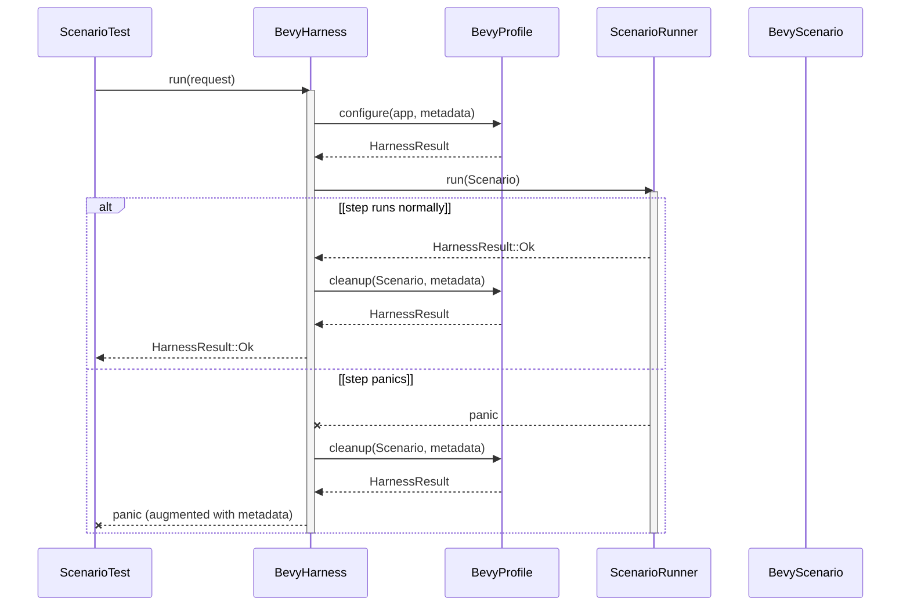

# `rstest-bdd-harness-bevy` design

Status: Proposed companion design

Audience: developers implementing Skyjoust behavioural tests, reviewers of the
`rstest-bdd` harness contract, and downstream maintainers evaluating extraction
into a standalone crate.

Scope: design a reusable Bevy harness adapter for `rstest-bdd` behavioural
tests. This document does not change Skyjoust runtime behaviour.

Companion documents:

- [Project Skyjoust technical design](skyjoust-technical-design.md)
- [Project Skyjoust roadmap](roadmap.md)
- [Skyjoust developer's guide](developers-guide.md)
- [Project Skyjoust development plan](development-plan.md)

## 1. Problem and context

Skyjoust needs behavioural tests that can exercise deterministic Bevy
entity-component system (ECS) schedules, resources, events, and repeated update
ticks without coupling the test crate to Bevy's renderer. The main technical
design already assigns ECS schedules and state resources to Bevy, while `winit`
and `pixels` own windowing and presentation for the Minimum Viable Product
(MVP).

`rstest-bdd` HEAD provides the harness extension points needed for this shape:
`HarnessAdapter`, associated `Context`, `ScenarioRunRequest`, `ScenarioRunner`,
`HarnessResult`, `ScenarioMetadata`, `AttributePolicy`, and `TestAttribute`.
The public manifest still labels those workspace crates as `0.6.0-beta2`, but
the branch head inspected for this design is commit `21b67a4`, which carries
the v0.6.0-beta3 harness API targeted by this work.

The design also needs to remain extractable. Skyjoust should incubate the crate
in-tree because that keeps review and validation local while the first runtime
resources are still forming. The harness crate itself must not depend on
Skyjoust or Lille. Downstream game-specific setup belongs in profile types
defined by each consumer.

## 2. Goals and non-goals

### Goals

- Add an in-tree workspace crate named `rstest-bdd-harness-bevy`.
- Expose a Bevy scenario context that owns a headless `bevy::prelude::App`.
- Let downstream profiles configure plugins, resources, schedules, events, and
  cleanup hooks before each scenario.
- Keep the default profile headless by using `App::new()` and
  `MinimalPlugins`, not Bevy's renderer or window stack.
- Support `#[scenario(harness = SkyjoustBddHarness)]` through a
  `Default`-constructible harness type.
- Document the reserved fixture key
  `#[from(rstest_bdd_harness_context)]` for step access to the scenario wrapper.
- Preserve extraction into a standalone `leynos/rstest-bdd-harness-bevy`
  repository as a directory move plus dependency rewiring.

### Non-goals

- Do not implement the harness in this design-only change.
- Do not add Skyjoust runtime resources before the runtime crate exists.
- Do not depend on Bevy rendering, windows, assets, or GPU setup in the default
  harness profile.
- Do not make arbitrary third-party `AttributePolicy::test_attributes()`
  execution a requirement; current `rstest-bdd` macros trait-check unknown
  policies but emit `#[rstest::rstest]` for them.
- Do not copy unsafe `Send` or `Sync` forwarding patterns into the reusable
  harness.

## 3. Prior art and constraints

`rstest-bdd` keeps scenario tests under the normal `cargo test` and `rstest`
execution model. Its third-party harness cookbook describes Bevy as a natural
adapter candidate and states that non-unit context harnesses pass their context
through the reserved fixture key `rstest_bdd_harness_context`.

The first-party Graphical Processing User Interface (GPUI) harness is the
closest implementation model. It implements `HarnessAdapter`, owns framework
setup and cleanup, logs `feature_path`, `scenario_name`, and `scenario_line`
when a step panics, and resumes unwinding with an augmented panic message. The
Bevy harness should mirror the diagnostic pattern without inheriting GPUI's
single-threaded runtime constraints.

Bevy 0.17.3 documents `App` as the primary application API for plugin setup and
the standard lifecycle. It documents `MinimalPlugins` as the minimal plugin
group for a Bevy application, including task pools, time, frame count, and the
schedule runner. That matches the headless behavioural test need better than a
raw `World`.

## 4. Architecture

The public API centres on these items:

```rust
pub struct BevyScenario;
pub trait BevyProfile;
pub struct BevyHarness<P = MinimalBevyProfile>;
pub enum BareBevyProfile {}
pub enum MinimalBevyProfile {}
pub struct BevyAttributePolicy;
```

`BevyScenario` is the harness context. It wraps `Rc<RefCell<App>>` and
`ScenarioMetadata`. This gives every step a cloneable handle to the same
scenario app, lets the harness inspect or clean up after the runner returns,
and keeps borrow conflicts explicit at the dynamic boundary.

`BevyHarness<P>` implements `HarnessAdapter` with
`type Context = BevyScenario`. The generic profile type supplies setup and
cleanup through `BevyProfile`. A type alias, such as `SkyjoustBddHarness`, lets
scenario macros use a short `syn::Path` instead of a generic type expression.

`BareBevyProfile` creates `App::new()` and adds no plugins. It exists for tests
that need to prove the harness does not assume `MinimalPlugins`.
`MinimalBevyProfile` adds `MinimalPlugins` and is the default compatibility
line.

## 5. Public API contract

`BevyScenario` exposes closure-based accessors rather than returning raw
borrows from the underlying `RefCell`:

```rust
impl BevyScenario {
    pub fn metadata(&self) -> &ScenarioMetadata;
    pub fn with_app<R>(&self, operation: impl FnOnce(&mut App) -> R) -> R;
    pub fn with_world<R>(&self, operation: impl FnOnce(&mut World) -> R) -> R;
    pub fn update(&self);
    pub fn update_times(&self, count: u32);
}
```

The closure API has two effects. It avoids leaking `RefMut<App>` into step
functions, and it lets the wrapper produce a precise panic message when a step
attempts a nested mutable borrow. Step functions should request
`&BevyScenario`, not `&mut BevyScenario`.

`BevyProfile` owns framework configuration:

```rust
pub trait BevyProfile: 'static {
    fn configure(app: &mut App, metadata: &ScenarioMetadata) -> HarnessResult<()>;

    fn cleanup(
        _scenario: &BevyScenario,
        _metadata: &ScenarioMetadata,
    ) -> HarnessResult<()> {
        Ok(())
    }
}
```

`configure` runs before the scenario runner receives the context. `cleanup`
runs after the runner succeeds and while unwinding after a step panic. Cleanup
errors on the panic path must be logged without suppressing the original panic.

## 6. Panic and cleanup behaviour

The harness must catch step panics around `runner.run(scenario.clone())`, run
profile cleanup, and resume unwinding with a message that includes:

- harness type,
- feature path,
- scenario name,
- one-based feature-file line number,
- original panic payload text when available.

On the normal path, cleanup errors return `Err(HarnessError)`. On the panic
path, cleanup errors become `tracing::error!` records with the same scenario
metadata, and the original augmented panic resumes. This preserves scenario
failure identity for `cargo test`, `cargo nextest`, and log subscribers.



_Figure 1: Bevy harness scenario lifecycle. The test calls `BevyHarness` with a
scenario request, the harness configures the Bevy app through `BevyProfile`,
runs the `ScenarioRunner` with a `BevyScenario`, and then calls profile cleanup
before returning success or resuming a metadata-augmented panic._

## 7. Macro and attribute policy constraints

Generated scenario tests instantiate the harness with
`<Harness as Default>::default()` and then call
`HarnessAdapter::run(&harness, request)`. A Bevy-specific setup that needs game
plugins must therefore live in the harness type selected by the scenario macro,
usually through a type alias:

```rust
pub enum SkyjoustBevyProfile {}

pub type SkyjoustBddHarness = BevyHarness<SkyjoustBevyProfile>;
```

The `#[scenario]` parser accepts `harness = ...` and `attributes = ...` as
paths. It cannot evaluate arbitrary third-party
`AttributePolicy::test_attributes()` implementations today.
`BevyAttributePolicy` should therefore emit only `rstest::rstest` and be
documented as a forward-compatible marker. Scenario crates using this
third-party harness must keep a direct development dependency on
`rstest-bdd-harness` while the macro uses the base harness API path for
non-first-party harnesses.

## 8. Downstream usage

Skyjoust should define its profile outside the reusable harness crate once the
first deterministic runtime resources exist:

```rust
pub enum SkyjoustBevyProfile {}

impl BevyProfile for SkyjoustBevyProfile {
    fn configure(app: &mut App, _metadata: &ScenarioMetadata) -> HarnessResult<()> {
        app.add_plugins(MinimalPlugins);
        app.add_plugins(skyjoust::testing::SkyjoustRuntimeTestPlugin);
        Ok(())
    }
}

pub type SkyjoustBddHarness = BevyHarness<SkyjoustBevyProfile>;
```

Step functions then request the scenario wrapper through the reserved fixture
key:

```rust
#[when("the fixed schedule advances once")]
fn fixed_schedule_advances_once(
    #[from(rstest_bdd_harness_context)] scenario: &BevyScenario,
) {
    scenario.update();
}
```

Lille can define an equivalent profile that adds `MinimalPlugins` and its
`DbspPlugin`. The shared harness crate remains independent because downstream
profiles, not the crate, reference game-specific plugins.

## 9. Crate layout and dependency strategy

The Skyjoust incubation crate should use this layout:

```plaintext
crates/rstest-bdd-harness-bevy/
|-- Cargo.toml
|-- src/
|   |-- lib.rs
|   |-- context.rs
|   |-- harness.rs
|   |-- panic.rs
|   |-- policy.rs
|   `-- profile.rs
`-- tests/
    |-- bevy_scenario.rs
    |-- panic_diagnostics.rs
    |-- profile_hooks.rs
    `-- features/
        `-- bevy_scenario.feature
```

The first compatibility line should target Bevy 0.17.3 with
`default-features = false`, because `bevy::prelude::*` is the natural import
surface for downstream steps and the default harness must stay headless. Until
`rstest-bdd` publishes v0.6.0-beta3, the harness crate should use git
dependencies against `https://github.com/leynos/rstest-bdd` `main`. After
publication, replace those with normal `0.6.0-beta3` crate dependencies.

## 10. Verification strategy

The first implementation slice should prove the harness before it proves
Skyjoust gameplay:

- unit coverage for `with_app`, `with_world`, `update`, `update_times`,
  metadata retention, profile configuration, profile cleanup, and
  cleanup-after-panic behaviour;
- behavioural coverage using a tiny Bevy resource and an `Update` system that
  increments it after `scenario.update()`;
- macro-shape coverage with `trybuild` proving that a type alias implementing
  `HarnessAdapter + Default` works under
  `#[scenario(harness = TestBevyHarness)]`;
- panic diagnostic coverage proving feature path, scenario name, and scenario
  line survive the unwind path.

Skyjoust-specific smoke coverage should wait until the first runtime state
resources exist. That smoke profile should assert the presence of state graph
resources and validator trace capture, then advance the app with explicit
`scenario.update()` calls.

## 11. Extraction plan

The harness crate should be fork-ready from its first commit:

- no dependency on `skyjoust` or `lille`;
- no checked-in Skyjoust profile inside the harness crate;
- public API names and module boundaries stable enough for a directory move;
- examples and tests using toy Bevy resources rather than game modules;
- dependency versions kept in one `Cargo.toml`.

Extraction into `leynos/rstest-bdd-harness-bevy` should happen after Skyjoust
and Lille each carry one headless behavioural scenario through their normal
gates. The extracted repository should replace git/path `rstest-bdd`
dependencies with published `0.6.0-beta3` crates, add continuous integration
for format, Clippy, tests, and documentation, and keep Skyjoust consuming the
crate by git dependency during the beta proving period.

## 12. Risks

Attribute-policy integration can be over-promised. The implementation must
state that third-party policy methods are not macro-evaluated today and that
`BevyAttributePolicy` is a marker until the policy resolver grows that support.

Bevy rendering can enter accidentally through convenient defaults. The default
profile must use only `MinimalPlugins`; rendering, windows, assets, and GPU
state belong to downstream profiles only when a scenario intentionally tests
those surfaces.

Borrow contention can make step failures hard to diagnose. `BevyScenario`
should keep all mutable access behind closure APIs and panic with a
crate-prefixed message when a nested borrow occurs.

Extraction can stall if Skyjoust-specific helpers land in the reusable crate.
The crate boundary must reject game modules, validator traces, and runtime
state resources unless they are represented as downstream profile code.

## 13. References

- `rstest-bdd` repository HEAD, commit `21b67a4`, inspected on
  2026-06-27: <https://github.com/leynos/rstest-bdd>.
- `rstest-bdd` third-party harness cookbook and GPUI harness documentation:
  <https://github.com/leynos/rstest-bdd/blob/main/docs/users-guide.md>.
- Bevy 0.17.3 `App` documentation:
  <https://docs.rs/bevy/0.17.3/bevy/app/struct.App.html>.
- Bevy 0.17.3 `MinimalPlugins` documentation:
  <https://docs.rs/bevy/0.17.3/bevy/prelude/struct.MinimalPlugins.html>.
- Skyjoust runtime ownership and testing constraints:
  [Project Skyjoust technical design](skyjoust-technical-design.md).
